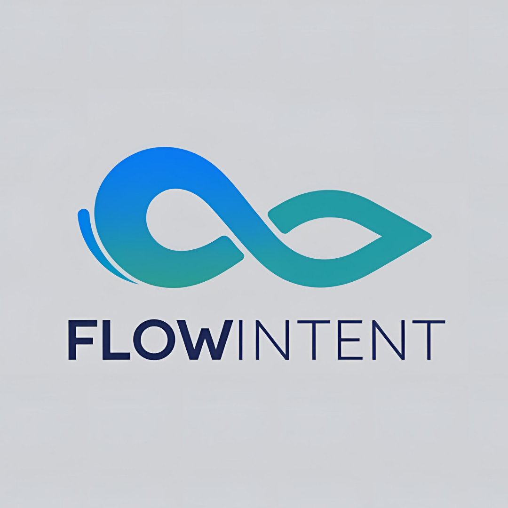

# FlowIntent

<details open>
<summary>FlowIntent: Empower Android Intents with Reactive Flows</summary>

### 1. Limitations of Static Intent Data  
Problem: Traditional Intent data transfer is one-time and static. Updating the target component with changing data requires additional mechanisms (e.g., BroadcastReceiver, LiveData).  

Solution: FlowIntent delivers dynamic data flows, allowing the target component to subscribe to real-time updates.
------------- ------------- ------------- ------------- ------------- ------------- 
### 2. Complexity of Asynchronous Data Transfer  
Problem: Sending asynchronous data between Activities or components often requires complex setups (e.g., EventBus, RxJava).  

Solution: FlowIntent simplifies this with Kotlin Flow, seamlessly integrating asynchronous streams.
------------- ------------- ------------- ------------- ------------- ------------- 
### 3. Lifecycle and State Management Challenges  
Problem: When transferring data via Intent, lifecycle mismatches can lead to data loss or synchronization issues.  

Solution: Integrated with ViewModel, FlowIntent provides a lifecycle-aware structure, reducing such risks.
------------- ------------- ------------- ------------- ------------- ------------- 
### 4. Code Repetition and Boilerplate  
Problem: Developers often need to write custom communication layers for dynamic data transfer.  

Solution: FlowIntent standardizes this process, reducing boilerplate code.
</details>


## Use Case Scenarios
### 1. Scheduling Dynamic Data Updates with FlowIntent
Description:
This use-case demonstrates how FlowIntent can schedule a job to emit dynamic data to a target activity over time. It’s ideal for real-time or periodic updates, such as live counters or streaming notifications.
How It Works:
* A FlowIntent instance targets an activity and uses a ViewModel to manage state.

* A coroutine job continuously emits data (e.g., an incrementing counter) with a delay.

* The target activity listens to this data flow and updates its UI.

Key Features:
* Dynamic data emission with emitData.

* Shared state via ViewModel.

* Lifecycle-aware execution.

Code Example:


```kotlin
class SenderActivity : AppCompatActivity() {
    private val viewModel by lazy { (application as App).sharedViewModel }
    private var counter = 0

    override fun onCreate(savedInstanceState: Bundle?) {
        super.onCreate(savedInstanceState)
        setContentView(R.layout.activity_sender)

        val flowIntent = FlowIntent(
            context = this,
            target = ReceiverActivity::class.java,
            viewModel = viewModel,
            cleanupPolicy = FlowCleanupPolicy.CLEANUP_PREVIOUS,
            scope = lifecycleScope
        )
        flowIntent.scheduleJob { intent ->
            while (true) {
                intent.emitData("count", "Update #$counter")
                counter++
                delay(1000)
            }
        }
        flowIntent.startWithBackStack(false)
    }
}

class ReceiverActivity : AppCompatActivity() {
    private val viewModel by lazy { (application as App).sharedViewModel }

    override fun onCreate(savedInstanceState: Bundle?) {
        super.onCreate(savedInstanceState)
        setContentView(R.layout.activity_receiver)

        val displayText = findViewById<TextView>(R.id.display_text)
        val flowId = FlowIntent.getFlowId(intent) ?: return
        val flow = viewModel.getFlow(flowId) ?: return

        lifecycleScope.launch {
            flow.collect { data ->
                if (data?.key == "count") {
                    displayText.text = data.value.toString()
                }
            }
        }
    }
}
```

* Example Scenario:
A live ticker displaying an updating counter or real-time status messages in an app.

------------- ------------- ------------- ------------- ------------- ------------- 

### 2. Simple Intent-Based Navigation with Dynamic Data
Description:
This use-case shows how SimpleFlowIntent facilitates navigation with initial and dynamic data passing. It’s a lightweight solution for basic activity transitions.
How It Works:
* SimpleFlowIntent launches a target activity with predefined and dynamic data.

* The target activity collects dynamic data updates in a coroutine and reflects them in the UI.

Key Features:
* Simplified API with withData and withDynamicData.

* Parent stack configuration support.

* Real-time data flow integration.

Code Example:
```kotlin
class LauncherActivity : AppCompatActivity() {
    override fun onCreate(savedInstanceState: Bundle?) {
        super.onCreate(savedInstanceState)
        setContentView(R.layout.activity_launcher)

        SimpleFlowIntent.from(this, DisplayActivity::class.java)
            .withData("greeting", "Hello!")
            .withDynamicData("status", "Starting")
            .withParent(LauncherActivity::class.java)
            .startWithBackStack(shouldClearTop = false)
    }
}

class DisplayActivity : AppCompatActivity() {
    override fun onCreate(savedInstanceState: Bundle?) {
        super.onCreate(savedInstanceState)
        setContentView(R.layout.activity_display)

        val statusText = findViewById<TextView>(R.id.status_text)

        lifecycleScope.launch {
            SimpleFlowIntent.current(this@DisplayActivity).getDynamicData()
                ?.collect { data ->
                    if (data?.key == "status") {
                        statusText.text = data.value.toString()
                    }
                }
        }
    }
}
```
* Example Scenario:
Passing a welcome message or status update to a settings screen or dashboard.

------------- ------------- ------------- ------------- ------------- ------------- 

### 3. Deeplink Navigation with JSON Validation
Description:
This use-case illustrates how SimpleFlowIntent manages deeplink navigation with JSON parameter validation, suitable for handling structured external links.
How It Works:
* A deeplink URI with JSON data is validated against custom rules.

* The target activity extracts and displays the validated data.

* Errors are logged if validation fails.

Key Features:
* Deeplink support with validation DSL.

* Error handling via onDeepLinkError.

* JSON parsing integration.

Code Example:
```kotlin
class EntryActivity : AppCompatActivity() {
    override fun onCreate(savedInstanceState: Bundle?) {
        super.onCreate(savedInstanceState)
        setContentView(R.layout.activity_entry)

        SimpleFlowIntent.from(this, ProfileActivity::class.java)
            .withDeeplink(Uri.parse("myapp://profile?data={\"userId\":\"456\",\"role\":\"admin\"}")) {
                jsonParam("data", isRequired = true) { json ->
                    json.getString("userId").isNotEmpty() && json.getString("role") in listOf("admin", "user")
                }
            }
            .onDeepLinkError { e -> Log.e("EntryActivity", "Deeplink failed: $e") }
            .startWithBackStack(shouldClearTop = false)
    }
}

class ProfileActivity : AppCompatActivity() {
    override fun onCreate(savedInstanceState: Bundle?) {
        super.onCreate(savedInstanceState)
        setContentView(R.layout.activity_profile)

        val idText = findViewById<TextView>(R.id.id_text)
        val roleText = findViewById<TextView>(R.id.role_text)

        val flowIntent = SimpleFlowIntent.current(this)
        val params = flowIntent.getDeepLinkParams()
        val jsonData = params.get<JSONObject>("data")
        idText.text = "User ID: ${jsonData?.getString("userId")}"
        roleText.text = "Role: ${jsonData?.getString("role")}"
    }
}
```

* Example Scenario:
Opening a user profile from a notification link with validated user ID and role data.

------------- ------------- ------------- ------------- ------------- ------------- 

### 4. DSL-Based Navigation with Deep Link Validation
Description:
This use-case shows how the flowIntentChain DSL creates complex navigation flows with deep link validation and result handling, offering flexibility for custom workflows.
How It Works:
* A DSL defines a flow with deep link parameters, a file picker, and a result-based viewer.

* Results are collected and displayed dynamically.

Key Features:
* Fluent DSL for navigation steps.

* Deep link validation within the flow.

* Coroutine-based result processing.

Code Example:
```kotlin
class PickerActivity : AppCompatActivity() {
    private lateinit var resultFlow: Flow<ActivityResult>

    override fun onCreate(savedInstanceState: Bundle?) {
        super.onCreate(savedInstanceState)
        setContentView(R.layout.activity_picker)

        val resultText = findViewById<TextView>(R.id.result_text)
        val params = DeepLinkParams().apply {
            put("fileId", "789")
            put("action", "view")
        }

        resultFlow = flowIntentChain(this) {
            withDeepLink(params) {
                param("fileId", isRequired = true) { it?.toString()?.isNotEmpty() == true }
                param("action", isRequired = true) { it == "view" || it == "edit" }
            }
            startActivityWithParent(PickerActivity::class.java) { _, _ ->
                Intent(Intent.ACTION_PICK).apply { type = "*/*" }
            }
            onResult { result ->
                val uri = result.data?.data ?: Uri.EMPTY
                if (uri != Uri.EMPTY) {
                    startActivity { _, _ -> Intent(Intent.ACTION_VIEW, uri) }
                }
            }
            onDeepLinkError { e -> Log.e("PickerActivity", "Error: ${e.message}") }
        }

        lifecycleScope.launch {
            resultFlow.collect { result ->
                resultText.text = result.data?.dataString ?: "No file selected"
            }
        }
    }
}
```

* Example Scenario:
A file picker that validates input and views the selected file’s content.

------------- ------------- ------------- ------------- ------------- ------------- 

### 5. Annotation-Based Navigation Flow
Description:
This use-case demonstrates how annotations define a navigation flow with deep link support, offering a declarative approach for structured workflows.
How It Works:
* Annotations configure a multi-step flow with validated deep link parameters.

* The flow progresses through activities, handling results and errors.

Key Features:
* Annotation-driven flow definition.

* Custom deep link validation.

* Error handling with annotations.

Code Example:
```kotlin
class WorkflowActivity : AppCompatActivity() {
    override fun onCreate(savedInstanceState: Bundle?) {
        super.onCreate(savedInstanceState)
        setContentView(R.layout.activity_workflow)

        val outputText = findViewById<TextView>(R.id.output_text)
        val params = DeepLinkParams().apply {
            put("taskId", "101")
            put("action", "fetch")
        }

        val flow = flowIntentChainFromAnnotations {
            withDeepLink(params) {
                param("taskId", isRequired = true) { it?.toString()?.isNotEmpty() == true }
                param("action", isRequired = true) { it == "view" || it == "edit" || it == "fetch" }
            }
        }

        lifecycleScope.launch {
            flow.collect { result ->
                outputText.text = result.data?.dataString ?: "No result"
            }
        }
    }

    @InitialStep
    @StartActivity(stepName = "start", parent = "com.example.WorkflowActivity")
    @DeepLinkParam(name = "taskId", isRequired = true, errorMessage = "Task ID required")
    @DeepLinkParam(name = "action", isRequired = true, validator = TaskActionValidator::class, errorMessage = "Action must be view, edit, or fetch")
    fun startStep(result: ActivityResult?, params: DeepLinkParams?): Intent {
        return Intent(this, DetailActivity::class.java).apply {
            params?.get<String>("taskId")?.let { putExtra("taskId", it) }
            params?.get<String>("action")?.let { putExtra("action", it) }
        }
    }

    @OnResult(nextStep = "next")
    fun onStartResult(result: ActivityResult) {
        Log.d("WorkflowActivity", "Step result: ${result.resultCode}")
    }

    @StartActivity(stepName = "next")
    fun nextStep(result: ActivityResult?, params: DeepLinkParams?): Intent {
        return Intent(this, SummaryActivity::class.java)
    }

    @OnDeepLinkError
    fun handleError(error: Throwable) {
        Log.e("WorkflowActivity", "Error: ${error.message}")
    }
}

class TaskActionValidator {
    fun invoke(value: Any?): Boolean {
        return value == "view" || value == "edit" || value == "fetch"
    }
}
```

Example Scenario:
A task management app navigating from a task list to details and summary screens with validated inputs.


------------- ------------- ------------- ------------- ------------- ------------- 
### General Benefits and Solution Summary
Flexibility: Transitions from static data transfer to dynamic flows.  

Modernity: Fully aligns with Kotlin Flow and Jetpack ecosystem.  

Simplicity: Reduces boilerplate compared to traditional methods.  

Reactivity: Natural solution for real-time data updates.
------------- ------------- ------------- ------------- ------------- ------------- 
### Potential Application Areas
Real-Time Apps: Maps, chat, monitoring tools.  

Form and Data Collection: Surveys, user input tracking.  

Background Tasks: Downloads, uploads, task tracking.  

Shared State Management: Data synchronization across components.
------------- ------------- ------------- ------------- ------------- ------------- 
### Conclusion
FlowIntent answers questions like "How do I carry dynamic data with Intents?" or "How can I simplify asynchronous communication?" It’s a powerful tool for developers building modern, reactive Android apps.


